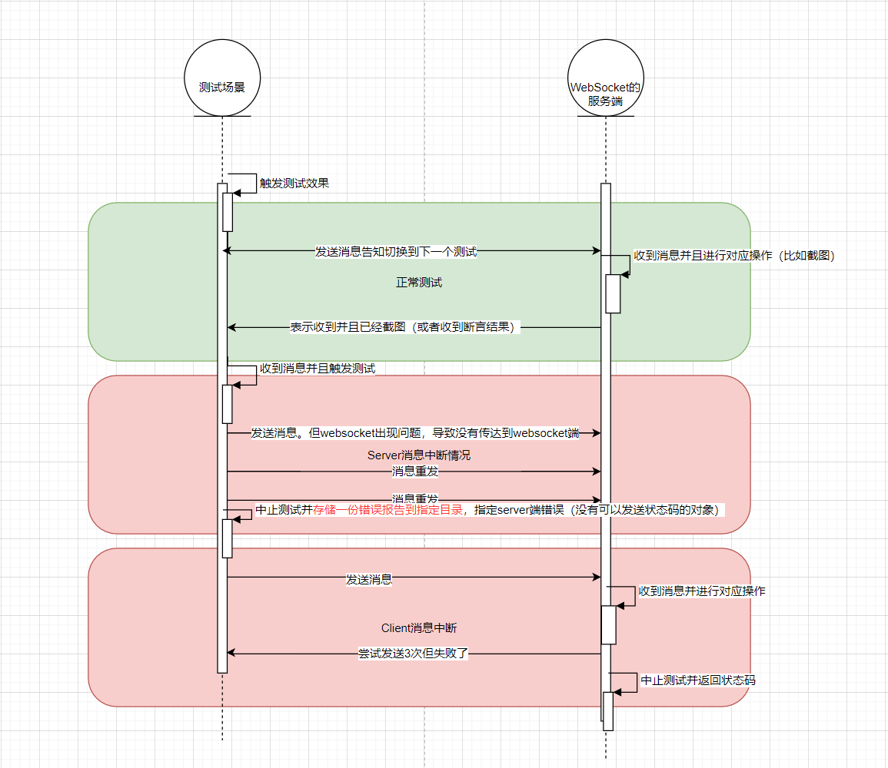
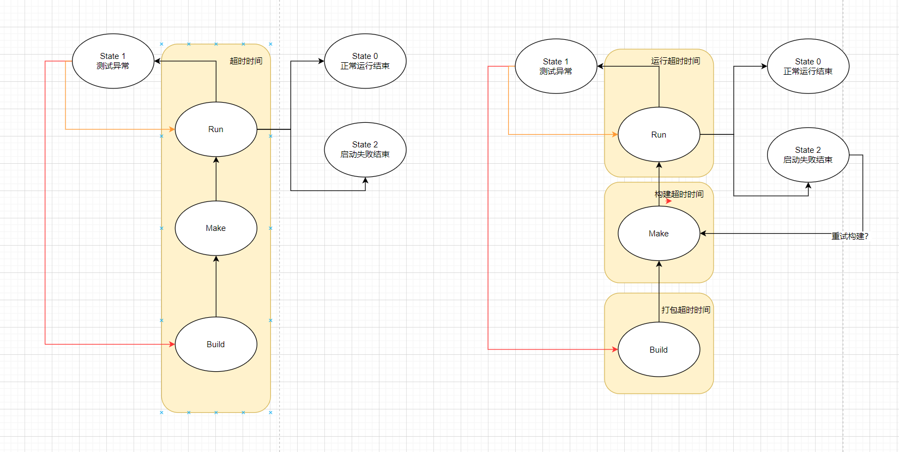
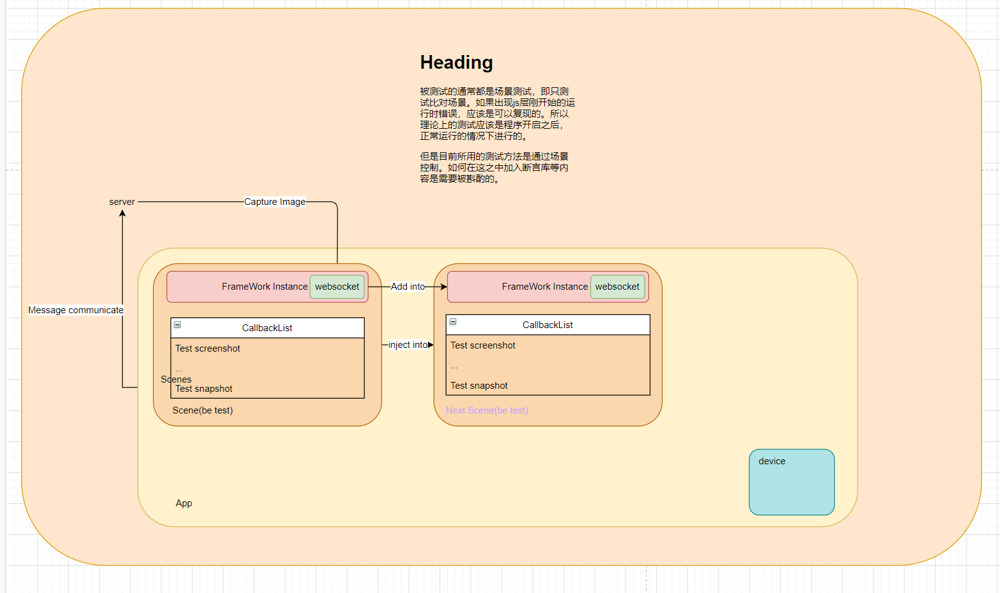
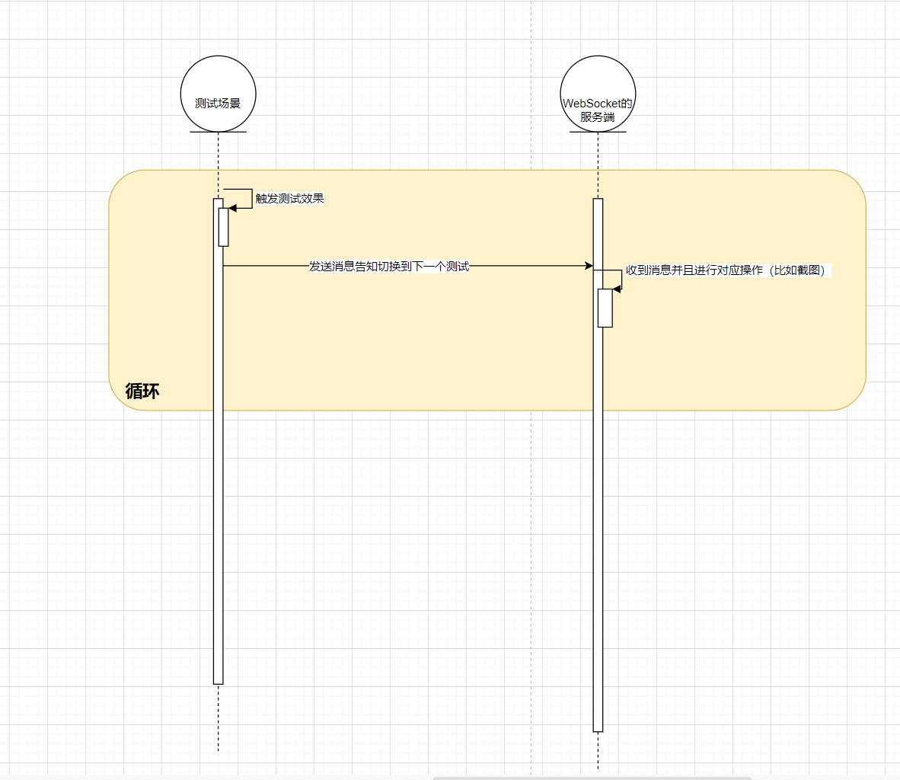

# 新测试框架设计文档

## 进入测试例后的测试流程



新的测试框架将从延时截图的方法转为回调方法。即收到消息之后进行截图等操作。与之前的操作不同之处在于，测试场景发送消息的时机从**开始加载测试条件就发送消息**变更为**测试条件加载完成后发送信息**，用来避免截图或者断言时场景细节没有加载完毕的情况。

加入了双向的判断机制，即当有一方断开websocket连接之后，会由另一方保留错误消息。当双方的websocket都断开时jenkins上可以很明显看出。但如果只有一方断开则Jenkins上目前不会有报错消息。

## 状态码

0. StartAllTest: 开始所有测试
1. StartCurrentCaseTest: 开始当前场景测试并包含当前场景名和部分信息
2. EndAllTest: 所有测试结束状态
3. SceneChange: 和之前一样表示切换场景
4. State2ScreenShot: 表示切换到需要截图的状态
5. State2SendRes: 表示切换到需要传输断言结果的状态，后接断言类型和断言结果
6. State2SendRenderSnapShot: 表示切换到需要传输帧数据的状态，后接帧数据类型和数据
7. ...

## 服务端设计模式



在分离了各个步骤的运行脚本的基础上，运行部分的设计模式将适配新的测试框架。如目前的运行超时时间在新的测试框架中可能不再需要。因为无论是客户端还是服务端都会返回详细的信息。

服务端的设计模式要满足：

1. 异步收发消息机制
2. 收到图片信息并保存（或者跟当前相同的截图模式）
3. 收到断言结果并输出到Jenkins结果中（undefined）
4. 收到状态型数据并与历史版本比较（undefined）
5. 消息发送重试机制（这个机制可以代替超时机制）

## 客户端设计模式

### 基础模式

FrameWork作为常驻节点（或者单例模式）分别注入到各个场景中，在进入场景之后自动开始执行FrameWork的StartTest函数。

测试项将会被修饰为Callback函数，并按顺序执行。并作为函数列表存在。

WebSocket将添加对应状态码的事件，并封装成Dispatch模式。

### 客户端开放接口（大概）新场景可用

callback函数装饰器

```ts
@cbBase(cbList:Function[])
Function testExample(){
    ...
}
```

FrameWork实例

```ts
//用来获取测试架构对象。
FrameWork.instance

//添加自定义的消息处理机制，同理增加自定义的消息事件。
FrameWork.instance.addMessegeHandler

//获取实例化的Chai断言库工具
FrameWork.Instance.getChai();

//添加暂停方法，可以用来在下一个测试暂停（）
FrameWork.PauseAtNextTest(timeout: int)

//添加可继承的方法。
Class myFrameWork extends Framework
```

### 配置文件格式（即Auto-test-config）

和之前大致一样，添加了SocketType表示是否使用加密websocket传输，便于开放使用。
考虑使用timeOut将用于确认最初的websocket连接状态重试。

## 断言结果规范

undefined

## 状态Json数据规范

undefined

## 超时时间的优化方式



针对当前的超时时间问题的临时解决方法

1. 添加接受消息的等待机制，如果一段时间没有收到消息则默认应用已关闭
2. 将超时时间分布到各个步骤，减少总的超时时间但可以增加容错。


